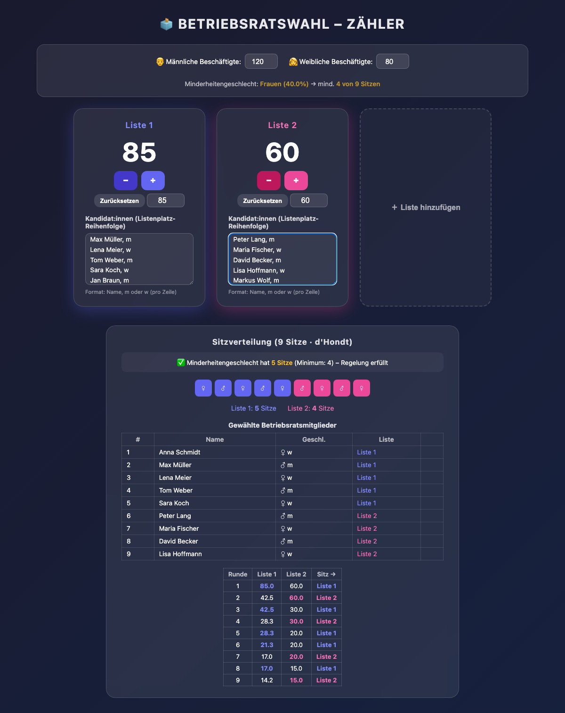

# 🗳️ Betriebsratswahl – Zähler App

Eine Web-App zur Auszählung von Betriebsratswahlen mit zwei Vorschlagslisten.

**👉 [Live-App öffnen](https://sandraahlgrimm.github.io/zaehler/)**

## Features

- **Stimmenzähler** für zwei Listen – per Klick (+/−) oder direkte Zahleneingabe
- **Sitzverteilung nach d'Hondt** (Höchstzahlverfahren) mit nachvollziehbarer Berechnungstabelle
- **Minderheitengeschlechterregelung** nach §15 Abs. 2 BetrVG – automatische Berechnung der Mindestsitze für das Minderheitengeschlecht
- **Namenslisten** – Kandidat:innen mit Geschlecht eingeben, die App zeigt die gewählten Mitglieder mit namentlicher Zuordnung
- Läuft komplett im Browser, keine Installation nötig

## Benutzung

1. **Belegschaftszahlen** eingeben (männliche/weibliche Beschäftigte) – daraus wird das Minderheitengeschlecht und die Mindestsitze berechnet
2. **Kandidat:innen** pro Liste eintragen, eine Person pro Zeile im Format: `Name, m` oder `Name, w`
3. **Stimmen zählen** – per +/− Buttons oder direkte Eingabe der Stimmenzahl
4. Die **Sitzverteilung**, die **gewählten Mitglieder** und eventuelle Korrekturen durch die Minderheitengeschlechterregelung werden automatisch angezeigt

## Hintergrund: Betriebsratswahlen

### Sitzverteilung nach d'Hondt

Bei Listenwahl (ab 3 zu wählende BR-Mitglieder und mehr als einem Wahlvorschlag) werden die Sitze nach dem **Höchstzahlverfahren nach d'Hondt** verteilt. Dabei wird die Stimmenzahl jeder Liste nacheinander durch 1, 2, 3 usw. geteilt und die Sitze in der Reihenfolge der höchsten Quotienten vergeben.

### Minderheitengeschlechterregelung (§15 Abs. 2 BetrVG)

Das Geschlecht, das in der Belegschaft in der Minderheit ist, muss mindestens entsprechend seinem zahlenmäßigen Verhältnis im Betriebsrat vertreten sein. Die Mindestsitze werden durch mathematisches Runden ermittelt. Falls nach der regulären Sitzverteilung zu wenige Sitze auf das Minderheitengeschlecht entfallen, werden Kandidat:innen des Mehrheitsgeschlechts durch nachrückende Kandidat:innen des Minderheitengeschlechts von derselben Liste ersetzt.

## Weiterführende Links

- [Betriebsverfassungsgesetz (BetrVG)](https://www.gesetze-im-internet.de/betrvg/) – Gesetzestext
- [§15 BetrVG – Zusammensetzung nach Geschlechtern](https://www.gesetze-im-internet.de/betrvg/__15.html)
- [Wahlordnung zum BetrVG (WO)](https://www.gesetze-im-internet.de/betrvgdv1wo_2001/) – Details zum Wahlverfahren
- [DGB: Betriebsratswahl](https://www.dgb.de/betriebsratswahl) – Übersicht und Infomaterial
- [IG Metall: Betriebsratswahl](https://www.igmetall.de/im-betrieb/betriebsrat/betriebsratswahl) – Praxisleitfaden
- [Bundeszentrale für politische Bildung: Betriebsrat](https://www.bpb.de/kurz-knapp/lexika/das-junge-politik-lexikon/320204/betriebsrat/) – Hintergrundwissen

## Technologie

Reine HTML/CSS/JavaScript Single-Page-App ohne Abhängigkeiten. Gehostet über GitHub Pages.

## Lizenz

Frei verwendbar.
